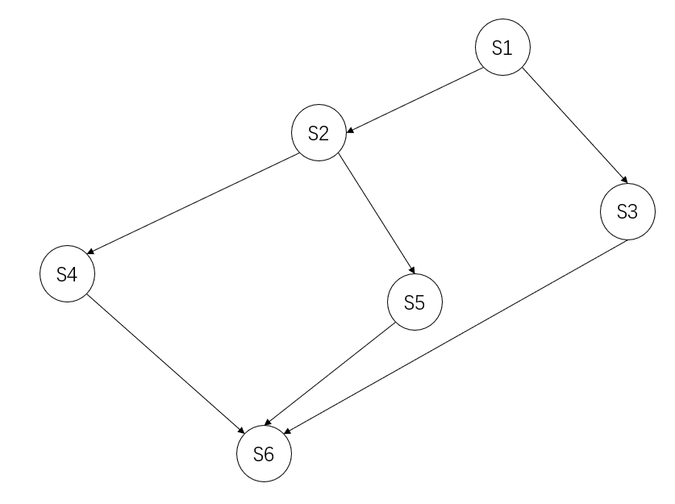
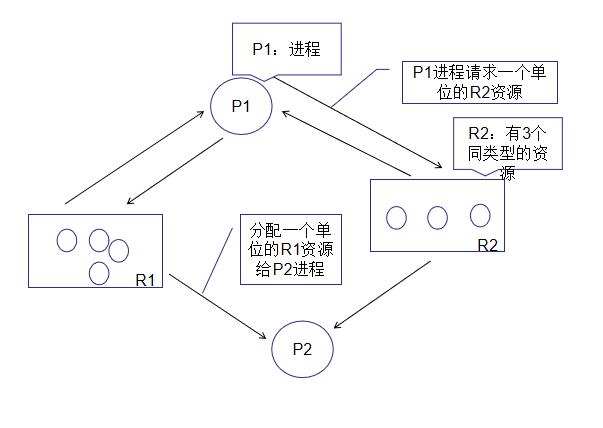

# 第一章 计算机系统概述

## 并发、共享、虚拟、异步

没有并发和共享，就没有虚拟和异步

并发和共享互为存在条件

只有系统有并发性，才能导致异步性

## 命令接口

联机：交互式

脱机：批处理

## 程序接口

系统调用（广义指令）

## 操作系统用作扩充机器

没有任何软件支持的计算机称为裸机

覆盖了软件的机器称为**扩充机器**或**虚拟机**

## 操作系统发展

手工操作系统：独占全机、CPU等待手工操作

单道批处理操作系统：解决人机矛盾、CPU和I/O设备速率不匹配、每次主机内存仅存放一道作业

多道批处理操作系统：资源利用率高、用户响应时间长、不提供人机交互

分时操作系统：同时、交互、独立、及时

实时操作系统：及时、可靠

网络操作系统

分布式计算机系统

个人操作系统

## 操作系统运行机制

CPU的状态划分为用户态、核心态

## 中断和异常

中断（外中断）：CPU执行指令意外的事件【设备发出的I/O结束中断】

异常（内中断、陷入）：CPU执行指令内部的事件【非法操作码、地址越界、算术溢出、虚拟存储系统的缺页、陷入指令】

## 中断处理过程


## 系统调用

用户程序中调用操作系统提供的子功能

程序员可以使用高级语言，估计又要可以调用库函数，有的库函数封装了系统调用

用户进程执行 调用系统调用 **进入核心态** 执行系统调用 **退出核心态** 从系统调用返回

## 大内核 微内核

大内核：内核代码庞大、结构混乱、难以维护、提供高性能系统服务

微内核：分离内核与服务、频繁切换用户核心态、操作系统执行开销大、内核内容少、方便维护

# 第二章 进程管理

进程:程序段、数据段、PCB进程控制块

进程映像是静态的，进程是动态的

动态、并发、独立、异步、结构

## 进程状态

运行、就绪、阻塞、创建、结束

## 进程通信

共享存储（需要同步互斥工具PV操作、低级：基于共享数据结构、高级：基于存储区）

消息传递（进程间数据交换以格式化消息为单位、直接/间接）

管道通信（pipe文件用于连接一个读进程和写进程通信、半双工、全双工需要两条管道）

## 线程 多线程

引入进程目的：更好的使多道程序**并发**执行

引入线程目的：减小程序在并发执行付出的时空开销，提高并发性能

线程：线程ID、程序计数器、寄存器结合、堆栈组合、三态【就绪、阻塞、运行】

轻量实体，无系统资源，唯一ID和线程控制块

用户级线程ULT：操作系统意识不到ULT的存在，有关线程管理由应用程序完成

内核级线程KLT：有关线程管理由内核完成

多线程模型：多对一、一对一、多对多（m<=n）

## 处理机调度

调度层次：作业调度（高）、内存调度（中）、进程调度（低）

不能进行进程调度与切换：处理中断、进程处于内核态、其他需要完全屏蔽中断的原子操作

调度方式：非剥夺调度（非抢占方式、适用于大多批处理系统、不能用于分时系统和大多数的实时系统）、剥夺调度（抢占方式、有优先权、短进程优先、时间片原则）

调度基本原则：CPU利用率、系统吞吐量、周转时间、等待时间、响应时间

系统吞吐量：单位时间内CPU完成作业的数量

周转时间：从作业提交到作业完成所用时间

$$
\begin{aligned}
&T=t_{等待}+t_{就绪队列排队}+t_{上处理机运行及输入输出}\\
&t_{周转时间}=t_{作业完成时间}-t_{作业提交时间}\\
&t_{平均周转时间}=\frac{\sum_i^n{t_i}}{n}(作业i的周转时间：t_i)\\
&t_{带权周转时间}=\frac{t_{作业周转时间}}{t_{作业实际运转}}\geq{1}\\
&t_{带权平均周转时间}=\frac{\sum_i^n{t_i}}{n}(作业i的带权周转时间：t_i)\\
\end{aligned}
$$

等待时间：进程处于等处理机状态的时间和

响应时间：从用户提交请求到系统首次产生响应所用时间

**调度算法**：先来先服务（FCFS、非抢占）、短作业优先（SJF、SPF）、抢占式短作业优先（SRTN）、优先级调度、高响应比优先（HRRN）、时间片轮转调度（RR）、多级反馈队列调度

1.先来先服务（FCFS）：简单，效率低；对长作业有利，对短作业不利；有利于CPU繁忙型作业，不利于I/O繁忙型作业；不会导致饥饿；多用于早期批处理系统

2.短作业优先（SJF、SPF）：当前已到达的最短作业先上处理机；有优先权、短进程优先、时间片原则；适用于实时/分时操作系统；调度机制导致长作业长时间不被调度（饥饿）；多用于早期批处理系统

3.抢占式短作业优先（SRTN）：最短剩余时间算法

4.优先级调度：适用于实时操作系统；剥夺、非剥夺、静态优先级、动态优先级；系统进程>用户进程 交互型进程>非交互型进程 I/O型进程>计算型进程;不导致饥饿

5.高响应比优先（HRRN）：多用于早期批处理系统

$$
\begin{aligned}
&响应比R_p=\frac{t_{等待时间}+t_{要求服务时间}}{t_{要求服务时间}}\geq{1}\\
\end{aligned}
$$

6.时间片轮转调度（RR）：时间片大小设置对系统性能影响很大，时间片足够大，以至于所有进程都能在一个时间片完成，退化为先来先服务算法；时间片太小，处理机频繁在进程间切换，增加处理机开销；时间片长短由系统的响应时间、就绪队列的进程数目、系统处理能力决定；不会导致饥饿

7.多级反馈队列调度：设置多个就绪队列，各个队列赋予不同优先级，赋予各个队列中进程执行时间片的大小各个不同，一个进程进入内存后挂在一级队列队尾，时间片内未完成进入第二级队列队尾，第一级队列为空下一级运行；课本认为是抢占式算法；

## 进程同步

临界资源：进入区、临界区、退出区、剩余区

同步：完成某种任务而建立的两个或多个进程，需要协调制约关系

互斥：一个进程使用临界资源另一个进程必须等待，当占用临界资源的进程退出临界区后，另一进程允许访问临界资源

为禁止两个进程进入同一个临界区，指定准则：

（1）空闲让进

（2）忙则等待

（3）有限等待

（4）让权等待

实现互斥基本方法：

（1）软件：单标志法（违背空闲让进）、双标志法先检查（违法忙则等待）、双标志法后检查（导致饥饿、违背空闲让进、有限等待）、皮特森算法Peterson's Algorithm（违法让权等待）

（2）硬件：中断屏蔽方法（禁止一切中断发生、优：简单高效 / 缺：不适用多处理机、用户进程，只适用于系统内核进程）、硬件指令方法TS/TSL（优：适用于任意数目的进程，无论是单处理机还是多处理机，简单容易验证其正确性 / 缺：不能实现让权等待，从等待中随机选择一个进临界区，可能导致饥饿）

**信号量**

整型信号量：用于表示资源数目的整型量S，只要信号量S<=0，就会不断测试，违背让权等待

``` C++
wait(S){
    while(S <= 0)
        S = S - 1;
}
signal(S){
    S = S + 1;
}
```

记录型信号量：一个用于记录资源数目的整型量value，一个进程链表L，链接等待资源的进程,S.L解决了让权等待的问题

``` C++
typedef struct{
    int value;
    struct process *L;
}semaphore;

void wait(semaphore S){
    S.value --;
    if(S.value < 0){
        add this process P to S.L;
    }
    block(S.L);
}

void signal(semaphore S){
    S.value ++;
    if(S.value <= 0){
        remove a process P from S.L;
        wakeup(P);
    }
}
```

利用信号量实现同步：前V后P，必须保证一前一后，实现同步关系

``` C++
semaphore S = 0;
P1(){
    x;
    V(S);
    ...
}
P2(){
    P(S);
    y;
    ...
}
```

利用信号量实现互斥：

``` C++
seamphore S = 1;
P1(){
    ...
    P(S);
    进程P1的临界区;
    V(S);
    ...
}
P2(){
   ...
   P(S);
   进程P2的临界区
   V(S);
   ...
}
```

利用信号量实现前驱关系：

对不同的临界资源设置不同的互斥信号量，PV必须成对出现



``` C++
semaphore a1 = a2 = b1 = b2 = c = d = e = 0;

S1(){
    ...
    V(a1);
    V(a2);
}

S2(){
    P(a1);
    ...
    V(b1);
    V(b2);
}

S3(){
    P(a2);
    ...
    V(c);
}

S4(){
    P(b1);
    ...
    V(d);
}

S5(){
    P(b2);
    ...
    V(e);
}

S6(){
    P(c);
    P(d);
    P(e);
    ...
}
```

另一角度：图论出度（P）入度（V）

**管程**

名称、共享结构数据、一组过程（函数）、设置共享结构数据初值

互斥特性由编译器负责实现

各外部进程/线程，只能从管程提供的特定入口才能访问共享数据

每次只允许一个进程在管程内执行某个内部过程

**经典同步问题**

*1.生产者消费者问题*

- 一组生产者进程(Producer)

- 一组消费者进程(Consumer)

- 共享初始为空 大小为n的缓冲区(Buffer)

```
semaphore mutex = 1;  //mutex
semaphore empty = n;  //buffer
semaphore full = 0;   //full

Producer(){
	while(1){
		Produce();
		P(mutex);
		add2Buffer();
		V(mutex);
		V(full);
	}
}

Consumer(){
	while(1){
		P(full);
		P(mutex);
		getFromBuffer();
		V(mutex);
		Consume();
	}
}
```

*2.读者写者问题*

- 读者进程(Reader)
- 写者进程(Writer)
- 共享一个文档(Document)
- 多进程读，不可多进程写
- 写进程写，不可读
- 写进程检查是否有读进程读

**读进程优先**

```  
int count = 0;
semaphore mutex = 1;
semaphore rw = 1;
Reader(){
	while(1){
		P(mutex);
		if(count == 0)
			P(rw);
		count++;
		V(mutex);
		Read();
		P(mutex);
		count--;
		if(count == 0)
			V(rw);
		V(mutex);
	}
}
Writer(){
	while(1){
		P(rw);
		write();
		v(rw);
	}
}
```

**写进程优先**

``` 
int count = 0;
semaphore mutex = 1;
semaphore rw = 1;
semaphore w = 1;
Writer(){
	while(1){
		P(w);
		P(rw);
		Write();
		V(rw);
		V(w);
	}
}
Reader(){
	while(1){
		P(w);
		P(mutex);
		if(count == 0)
			P(rw);
		count++;
		V(mutex);
		V(w);
		Read();
		P(mutex);
		count--;
		if(count == 0)
			V(rw);
		V(mutex);
	}
}
```

*3.哲学家进餐问题*

- 5名哲学家(Philosopher)
- 每两名之间有一根筷子(Chopstick)
- 每名有一碗饭
- 吃完饭思考

``` 
semaphore Chopsticks[5] = {1, 1, 1, 1, 1};
semaphore mutex = 1;
Philosopher(){
	do{
		P(mutex);
		P(Chopsticks[i]);
		P(Chopsticks[(i+1)%5]);
		V(mutex);
		eat();
		V(Chopsticks[i]);
		V(Chopsticks[(i+1)%5]);
		think();
	}
}
```

**4.吸烟者问题**

- 3个吸烟者进程(Smoker)
- 1个提供者进程(Offer)
- Smoker1(paper, glue)
- Smoker2(tobacco, glue)
- Smoker3(paper, tobacco)
- Offer(offer1) return paper, glue
- Offer(offer2) return tobacco, glue
- Offer(offer3) return paper, tobacco

```
int num = 0;	//store random num
semaphore offer1 = 0;
semaphore offer2 = 0;
semaphore offer3 = 0;
semaphore end = 0;
Offer(){
	whlie(1){
		num++;
		num = num % 3;
		if(num == 0)
			V(offer1);
		else if(num == 1)
			V(offer2);
		else
			V(offer3);
		P(end);
	}
}
Smoker1(){
	while(1){
		P(offer3);
		smoke();
		V(end);
	}
}
Smoker2(){
	while(1){
		P(offer2);
		smoke();
		V(end);
	}
}
Smoker3(){
	while(1){
		P(offer1);
		smoke();
		V(end);
	}
}
```

*eg1*

- 3个进程P1 P2 P3
- 互斥使用N个单元的缓冲区(Buffer)
- P1 produce() return (int num) put() @Buffer
- P2 

**死锁**

多个进程因竞争资源造成的一种互相等待，若无外力作用，这些进程都将无法向前推进

死锁产生的原因：（1）系统资源的竞争（2）进程推进顺序非法（3）死锁产生的必要条件：互斥条件、不剥夺条件（已经至少保持了一个资源）、请求并保持条件、循环等待条件

**发生死锁一定有循环等待，但发生循环等待未必死锁**

**死锁的处理策略**

**死锁预防**：破坏四个必要条件之一即可

- 破坏互斥条件

- 破坏不剥夺条件

- 破坏请求并保持条件

- 破坏循环等待条件

死锁避免：在资源分配过程，防止进入不安全状态
- 银行家算法 

$$Need = Max -Allocation$$

死锁检测和解除：系统分配进程时不做措施，应该提供死锁检测和解除的手段

- 资源分配图



请求边：从进程到资源
分配边：从资源到进程

- 死锁定理：依次消除与不阻塞进程相连接的边，直到无边可消除
- 死锁解除：资源剥夺法、撤销进程法、进程回退法

# 第三章 内存管理

**程序装入和链接**

- 编译：编译程序将源代码编译成若干目标模块
- 链接：链接程序将编译后形成一组目标模块及所需的库函数链接在一起，形成一个完整的装入模块
- 装入：装入程序装入模块装入内存运行

链接方式

- 静态：程序运行前，链接为一个完整可执行的程序
- 装入时动态：装入过程中，边装入边链接
- 运行时动态：程序执行过程需要该模块才进行

装入方式：

- 绝对装入：仅适用于单道程序，装入程序按照装入模块中的地址，将程序数据装入内存，逻辑地址与物理地址完全相同
- 可重定位装入（静态重定位）：一个作业装入内存，**必须给它分配要求的全部内存空间**，若没有足够的内存，则无法装入。一旦运行，作业进入内存，整个运行期间不能在内存中移动，也不能再申请内存空间
- 动态运行时装入（动态重定位）：程序在内存中发生移动，则需要采用动态的装入方式。装入程序把装入内存后，并不立即将装入模块中的相对地址转换为绝对地址，而是将**地址转换推迟到程序真正要执行时才进行**，需要重定位寄存器的支持

逻辑地址和物理地址

- 地址重定位：当装入程序将可执行代码装入内存时，必须通过地址转换将逻辑地址转换成为物理地址

内存保护

- 在CPU中设置一堆上、下限寄存器，CPU要访问一个地址，分别和两个寄存器值相比，判断有无越界
- 采用重定位寄存器（基址寄存器）和界地址寄存器（限长寄存器）来实现这种保护

**连续分配管理方式**

单一连续分配

内存分为系统区、用户区，无需进行内存保护，内存中只允许有有一道程序

- 优 简单无外部碎片
- 缺 只能用于单用户、单任务的操作系统中，有内部碎片，存储器利用率极低

**固定分区分配**

将用户内存空间划分为若干固定大小的区域，每个分区只装入一道作业。当有空闲分区时，可从外存的后备作业队列中选择适当大小的作业装入

- 划分分区方式：分区大小相等、分区大小不等

问题

- 程序可能太大放不进任何一块分区，用户不得不使用覆盖技术使用内存空间
- 主存利用率低，程序小也要占用一个分区，现象称为**内部碎片**

**动态分区分配**

又称可变分区分配，不预先划分内存，在进程装入内存时，根据进程大小动态地建立分区，并使分区的大小正好适合进程的需要

问题：所有分区外的存储空间会产生越来越多的碎片，克服外部碎片可以通过紧凑技术来解决

动态分区策略

- 首次适应Fiist Fit：空闲分区以地址递增的次序链接，找到大小能满足要求的第一个空间。会使得内存的低地址部分出现很多小的空闲分区，每次分配查找时，都要经过这些分区，增加了查找的开销

- 最佳适应Best Fit：空闲分区按容量递增的方式形成分区链，找到第一个能满足要求的空间。性能通常很差，因为每次最佳的分配会留下很小难以利用的内存块，会产生最多的外部碎片。

- 最坏适应Worst Fit（最大适应Lasgest Fit）:以容量递减的次序链接，找到第一个能满足要求的空闲分区。选择最大的块，但却把最大的连续内存的划分开，会很快导致没有可用的大内存块，导致性能很差

- 邻近适用Next Fit（循环首次适应算法）：分配内存时从上次查询结束的位置开始继续查找。在一次扫描中，内存前面部分使用后再释放时，不会参与分配，导致在内存的末尾分配空间分裂为小碎片。

**非连续分配**

基本分页存储管理方式

